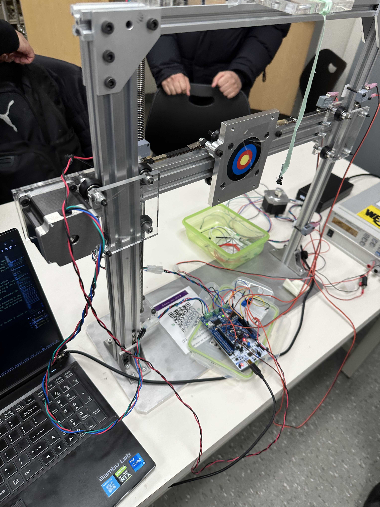
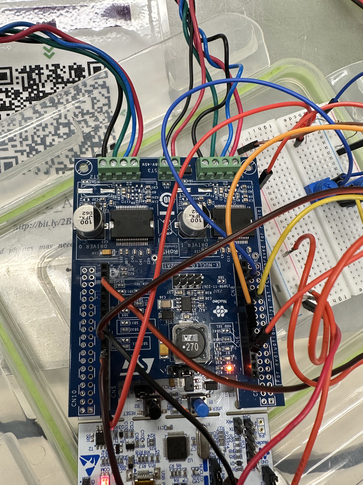
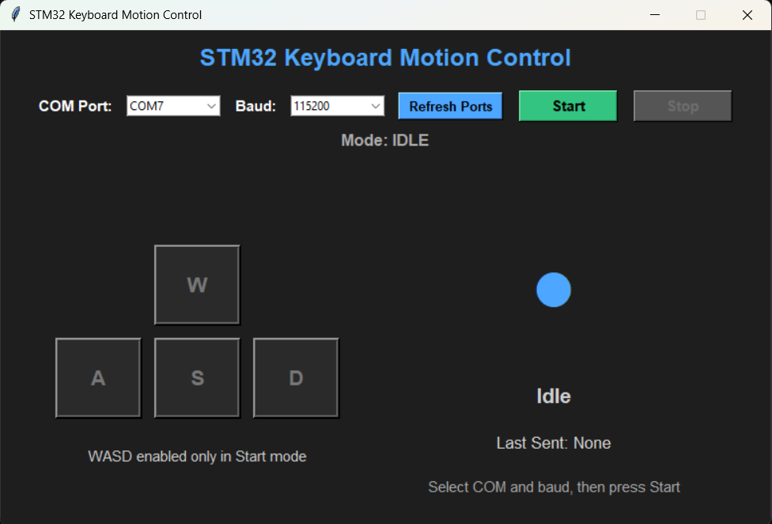

# STM32 Two-Axis Machine Control

STM32-based embedded control project for a two-axis machine driven by two stepper motors. The system uses potentiometer-based ADC speed control, interrupt-driven limit switch safety, SPI motor-driver communication, UART manual control, and a Python GUI for direct user operation.

This project was completed for MTE 325 and focused on applying embedded systems concepts to a real hardware platform: peripheral configuration, polling vs interrupts, ADC characterization, motor control, UART communication, and system-level safety handling.

> Note: This was completed as a group course project for MTE 325. This repository highlights my implementation work, documentation, and system integration contributions.



## Demo

Demo folder:  
https://drive.google.com/drive/folders/1DSZOzzM9O2JOJqB40VQ0yBSDtRi_iyZa?usp=sharing

Demo videos:
- Demo 1: https://drive.google.com/file/d/1I3mCT2xIy3bBejYWqJA6apu2jjCAlniW/
- Demo 2: https://drive.google.com/file/d/1OqJbgLzihHthyge3sKhTlL_7apw86IUl/
- Demo 3: https://drive.google.com/file/d/1VmHeQlyNQaXavxj6MBrBOQC8uks0vpJQ/

## My Contributions

My main contributions included STM32 firmware development, ADC speed-control integration, UART/manual-control logic, Python GUI development, interrupt/limit-switch debugging, and system-level testing. I also contributed to hardware wiring, oscilloscope-based debugging, documentation, and final system integration.

## Tech Stack

- Microcontroller: STM32 Nucleo-F401RE
- Motor driver shield: X-NUCLEO-IHM02A1
- Motor driver IC: L6470 stepper motor driver
- Programming language: C
- Development environment: VS Code + PlatformIO
- Firmware libraries: STM32 HAL, L6470 motor driver library
- Communication interfaces: SPI, UART, GPIO EXTI, ADC
- PC control tool: Python GUI
- Python libraries/tools: PySerial, Tkinter
- Debug/test tools: serial terminal, oscilloscope, digital multimeter, signal generator, bench power supply

## Project Goals

- Control a two-axis machine using two independently driven stepper motors
- Use ADC readings from potentiometers to control motor speed in real time
- Use limit switches to prevent the machine from driving past physical boundaries
- Compare polling and interrupt-based synchronization for embedded response timing
- Implement safe direction changes using hard stops before reversing motor direction
- Add UART-based manual control using serial commands and a Python GUI
- Handle edge cases such as startup at a limit switch, switch bounce, and fault conditions
- Document the hardware wiring, pin mapping, control logic, and testing process clearly

## What We Built

The final system combines automatic and manual control modes.

In normal mode, both motors run continuously within the machine boundaries. Each axis has its speed controlled by a potentiometer connected to the STM32 ADC. When a limit switch is triggered, the firmware commands the affected motor to move away from the switch, keeping the platform inside the safe motion range.

In manual mode, a Python GUI sends UART commands to the STM32 so the user can move or stop each axis directly. The system still respects the limit switches in manual mode, so the user cannot intentionally drive the platform past its mechanical limits.

The firmware includes:
- ADC scan conversion for two potentiometers
- Real-time speed mapping from ADC values to motor speed commands
- GPIO external interrupts for four normally closed limit switches
- SPI communication with the X-NUCLEO-IHM02A1 motor driver shield
- UART command parsing for manual control
- Fault detection if both switches on the same axis are triggered
- Fault LED output and reset-based recovery
- Direction tracking variables to prevent synchronization conflicts between ADC updates and limit-switch interrupts

## Hardware and Materials

### Main Hardware

- STM32 Nucleo-F401RE development board
- X-NUCLEO-IHM02A1 motor driver shield
- L6470 stepper motor driver ICs
- 2-axis machine platform
- 2 stepper motors
  - Motor 0: horizontal axis
  - Motor 1: vertical axis
- 2 potentiometers
  - Potentiometer A: horizontal-axis speed control
  - Potentiometer B: vertical-axis speed control
- 4 normally closed limit switches
  - X-left
  - X-right
  - Y-top
  - Y-bottom
- Fault LED
- 1 kΩ resistor for the LED circuit
- Breadboard
- Jumper wires
- Micro-USB cable for programming and UART communication
- External 12 V DC power supply

### Test and Debugging Equipment

- Oscilloscope
- Digital multimeter
- Signal generator
- Bench power supply
- PC/laptop running VS Code, PlatformIO, and Python

## System Architecture

The STM32 reads two potentiometers through ADC1 and uses the readings to update motor speed. Limit switches are connected as GPIO external interrupts so the system can quickly respond to unsafe travel limits. Motor commands are sent to the X-NUCLEO-IHM02A1 shield over SPI. UART is used for serial communication between the STM32 and the Python manual-control GUI.

A full connection block diagram is included in the repository:

- `docs/Connection_block_diagram.pdf`
- `docs/block_diagram.drawio`



## Pin Mapping

### ADC Inputs

| Function | STM32 Pin | ADC Channel | Purpose |
|---|---:|---:|---|
| Potentiometer A | PA0 / A0 | ADC1_CH0 | Horizontal-axis speed control |
| Potentiometer B | PB0 / A3 | ADC1_CH8 | Vertical-axis speed control |

ADC configuration:
- ADC peripheral: ADC1
- Resolution: 8-bit
- Conversion mode: scan conversion, 2 channels
- Sampling time: 15 cycles
- ADC clock: PCLK2 / 4 = 21 MHz
- ADC raw range: 0 to 255

### Limit Switches

| Limit Switch | STM32 Pin | EXTI Line | Action |
|---|---:|---:|---|
| X-left | PA8 / D7 | EXTI8 | Reverse/stop horizontal axis away from left limit |
| X-right | PA9 / D8 | EXTI9 | Reverse/stop horizontal axis away from right limit |
| Y-top | PA10 / D2 | EXTI10 | Reverse/stop vertical axis away from top limit |
| Y-bottom | PB6 / D10 | EXTI6 | Reverse/stop vertical axis away from bottom limit |

Limit switch configuration:
- Normally closed switches
- 3.3 V bias
- Falling-edge interrupt trigger
- Pulldown configuration used in firmware
- Software debounce before accepting a switch event

### Fault LED

| Function | STM32 Pin | Purpose |
|---|---:|---|
| Fault LED | PB8 / D15 | Turns on when a hard fault is detected |

The LED turns on when `fault_detected = true`. The system must be reset to clear the fault.

### UART Manual Control

| Function | STM32 Pin | Setting |
|---|---:|---|
| USART2 TX | PA2 | 115200 baud |
| USART2 RX | PA3 | 115200 baud |

UART settings:
- Baud rate: 115200
- Data bits: 8
- Stop bits: 1
- Parity: None
- Flow control: None

### SPI Motor-Driver Interface

The STM32 communicates with the X-NUCLEO-IHM02A1 shield through SPI. The shield uses L6470 stepper motor driver ICs in a daisy-chain configuration.

Common motor commands used:
- `Run`
- `Stop`
- `HardStop`
- Direction/status checks
- L6470 status-register reads

## Motor Control

### Axis Mapping

| Motor | Axis | Mechanism | Speed Range |
|---|---|---|---:|
| Motor 0 | Horizontal axis | Belt drive | 0 to 7,000 |
| Motor 1 | Vertical axis | Lead screw | 0 to 70,000 |

The two speed ranges are different because the horizontal and vertical mechanical systems behave differently. The horizontal belt-driven axis moves faster at lower command values, while the vertical lead-screw axis requires a larger speed command range for practical motion.

### ADC-to-Speed Mapping

The potentiometers produce analog voltages that are converted into 8-bit ADC values from 0 to 255.

The firmware maps these ADC values into motor speed commands:

```c
horizontal_speed = ADC_x * (7000 - 0) / 255;
vertical_speed   = ADC_y * (70000 - 0) / 255;
```

Earlier testing also used a single-motor range of 10,000 to 50,000 during ADC characterization before the final two-axis speed ranges were selected.

To reduce unnecessary updates from small potentiometer fluctuations, speed updates are filtered so that not every small ADC change immediately triggers a new motor command.

## Operating Modes

### Normal Mode

In normal mode:
- Motor speed is controlled by the potentiometers
- The ADC continuously updates speed values
- Limit switches control direction changes
- The system automatically moves away from a triggered limit switch
- Fault detection remains active

### Manual Control Mode

Manual mode is controlled through UART using a Python GUI.

Supported UART commands:

| Command | Meaning |
|---|---|
| `XP` | Move X axis in positive direction |
| `XN` | Move X axis in negative direction |
| `XS` | Stop X axis |
| `YP` | Move Y axis in positive direction |
| `YN` | Move Y axis in negative direction |
| `YS` | Stop Y axis |
| `NRMLCNTRL` | Return to normal ADC-based control mode |

The Python GUI lets the user:
- Select the COM port
- Select the baud rate
- Start/stop manual control
- Send direction commands using keyboard input
- View the current command being sent
- View key press status and motion direction
- Display serial communication errors

To keep the STM32 in manual mode safely, the GUI repeatedly sends stop commands when no movement is requested.

## Safety Logic

Safety was a major part of the firmware design.

### Limit Switch Response

When a limit switch is triggered:
1. The GPIO EXTI interrupt fires
2. The firmware identifies which switch caused the interrupt
3. The relevant motor is commanded away from the limit switch
4. Manual inputs are temporarily ignored until the switch is released
5. Normal/manual control resumes only once the machine is back in a safe region

### Direction Changes

The system uses a hard stop before reversing direction.

This was chosen because a soft stop caused too much overshoot during testing. The hard stop produced more reliable behavior near limit switches and made direction changes safer for the machine.

Direction-change sequence:
1. Stop the motor immediately
2. Apply a short no-interrupt delay
3. Restart the motor in the desired direction

### Fault Mode

A fault is detected if both limit switches on the same axis are triggered at the same time. This should not happen during normal operation because the platform cannot physically be at both ends of one axis.

Possible causes:
- Incorrect wiring
- Mechanical obstruction
- Sensor malfunction
- Misalignment

Fault response:
- Motor 0 hard stop
- Motor 1 hard stop
- `fault_detected = true`
- Fault LED turns on
- Motors will not move while in fault mode
- The STM32 must be reset to clear the fault

### Startup Edge Case

If the system starts while already touching a limit switch, the motor is commanded away from the switch so the machine returns to a safe operating region.

## Synchronization and Debugging

During testing, a synchronization issue appeared between ADC-based speed updates and limit-switch interrupts.

The issue occurred because the ADC polling loop could read the motor direction, then a limit-switch interrupt could change the direction, and then the ADC code could continue and accidentally restore the old direction.

To fix this, the firmware was updated to track motor speed, direction, and stopped/running state using global state variables instead of relying only on driver-register reads during ADC updates. This allowed the ADC speed-control logic and interrupt safety logic to stay synchronized.

This fix made the limit-switch direction command take priority over normal ADC speed updates.

## Polling vs Interrupt Testing

Before implementing the limit-switch safety system, polling and interrupt-based synchronization were tested using an STM32 GPIO input, GPIO output, oscilloscope, and signal generator.

Measured reliable response limits:
- Tight polling: approximately 490 kHz
- Interrupts: approximately 590 kHz

Interrupts were selected for the limit switches because they:
- Respond quickly to asynchronous switch events
- Reduce CPU overhead compared to constant polling
- Allow the firmware to react immediately when the machine reaches a boundary

## ADC Characterization

The ADC was characterized using potentiometer voltage measurements. The measured ADC output showed a linear relationship with input voltage.

ADC details:
- 8-bit resolution
- 256 discrete levels
- 3.3 V reference
- Voltage resolution of about 12.9 mV per step
- Theoretical quantization error of about ±6.45 mV
- Linear relationship between input voltage and ADC output during testing

The ADC was accurate enough for manual speed control because the potentiometer is adjusted by hand, so 8-bit resolution provided a good balance between smoothness and stability.

## Python GUI

The Python manual-control GUI is included in the repository and is used to send UART commands to the STM32 for manual X/Y axis control.



Main functions:
- Opens a serial connection to the STM32
- Sends UART commands for X/Y movement and stopping
- Displays which keys are currently pressed
- Displays the last command sent
- Sends stop commands repeatedly when an axis should remain stopped
- Handles contradictory key presses as a stop condition
- Allows returning to normal ADC-based control using `NRMLCNTRL`

## Repository Structure

```text
.
├── README.md
├── assets/
│   ├── Connections.jpg
│   ├── GUI_screenshot.png
│   └── Machine_img1.jpg
├── Docs/
│   ├── block_diagram
│   ├── connection_block_diagram.pdf
│   └── MTE325_lab_notes_sanitized.pdf
├── Firmware/
│   └── w23_two_axis_project-limit_switch_yaseen/
│       ├── .vscode/
│       ├── include/
│       ├── src/
│       ├── .gitignore
│       ├── platformio.ini
│       ├── README.md
│       └── stm32f4xx_hal_uart.c
└── GUI/
     └──Python_Keyboard_CNTRL_GUI/
        ├── Keyboard_CNTRL.py
        └── Requirements.txt
```

## How to Run

### STM32 Firmware

1. Open the STM32 firmware project in VS Code with PlatformIO.
2. Build the project.
3. Upload the firmware to the STM32 Nucleo-F401RE using the onboard ST-Link over micro-USB.
4. Connect the X-NUCLEO-IHM02A1 motor driver shield.
5. Connect the external 12 V motor supply to the shield.
6. Connect potentiometers, limit switches, and the fault LED according to the pin mapping above.
7. Open a serial monitor at 115200 baud if testing UART output.
8. Reset the STM32 board and verify motor behavior.

### Python Manual-Control GUI

1. Install Python 3.
2. Install PySerial if needed:

```bash
pip install pyserial
```

3. Run the Python GUI script from the `gui/` folder.
4. Select the correct COM port and baud rate.
5. Start manual mode.
6. Use the GUI/keyboard controls to send X/Y movement commands.
7. Use `NRMLCNTRL` or the GUI return-control option to go back to normal potentiometer-based control.

## Testing Summary

The system was tested through multiple stages:

- GPIO input/output testing
- Polling vs interrupt response testing using a signal generator and oscilloscope
- Limit switch interrupt testing with manually triggered switches
- ADC characterization using potentiometer voltage readings
- ADC speed mapping to motor speed commands
- Motor direction and stop behavior testing
- Manual UART command testing
- Python GUI control testing
- Fault handling when both switches on one axis are triggered
- Startup behavior when a limit switch is already pressed

The final system successfully integrated ADC-based speed control, interrupt-driven limit switch protection, SPI motor-driver commands, UART manual control, and Python GUI operation.

## Key Skills Demonstrated

- Embedded C programming
- STM32 HAL configuration
- GPIO input/output
- GPIO external interrupts
- ADC configuration and characterization
- SPI motor-driver communication
- UART serial communication
- Stepper motor control
- Limit switch safety handling
- Embedded debugging with lab equipment
- Python GUI development
- Hardware/software integration
- System-level fault handling

## Limitations and Future Improvements

- Add a cleaner finite-state machine structure for normal, manual, and fault modes
- Add stronger software debouncing using timer-based logic instead of a busy-loop delay
- Add a homing sequence at startup
- Add position tracking or encoder feedback for more accurate positioning
- Improve the Python GUI with live feedback from the STM32
- Add a formal wiring table or harness diagram for easier reproduction
- Move reusable motor-control, ADC, UART, and safety logic into separate source files

## About

STM32-based two-axis machine controller using ADC speed control, interrupt-driven limit switches, SPI stepper drivers, UART manual control, and a Python GUI for safe X/Y motion control.
